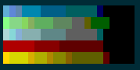
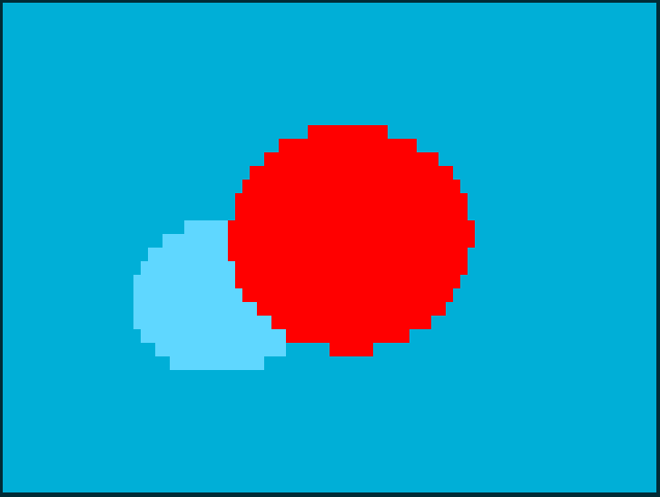
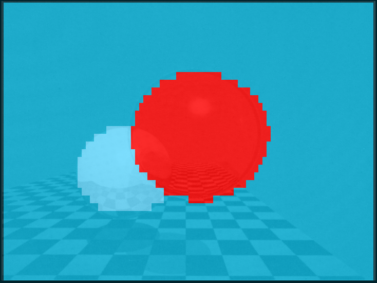
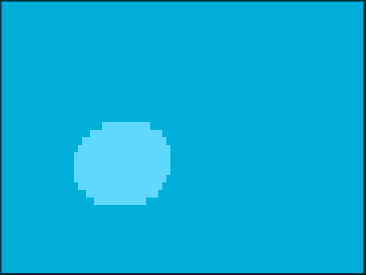

# Bash Raytracer

[![Lint code base][lbadge]][lwf]
[![Add issues to project][ibadge]][iwf]

[lbadge]: <https://github.com/bewuethr/bash-raytracer/actions/workflows/linter.yml/badge.svg>
[lwf]: <https://github.com/bewuethr/bash-raytracer/actions/workflows/linter.yml>
[ibadge]: <https://github.com/bewuethr/bash-raytracer/actions/workflows/addtoproject.yml/badge.svg>
[iwf]: <https://github.com/bewuethr/bash-raytracer/actions/workflows/addtoproject.yml>

A raytracer written in Bash (except for floating point calculations, where I
use `bc`). It requires a terminal emulator capable of displaying 256 colours
(using the `-8` option) or true colour.

## Change log

### 2016/11/02

The latest changes allow for quite some variety in what can be achieved &ndash;
for example a checkered plane with a single light source (suffering horribly
from aliasing):


The same scene seen from the top, better hiding the fact that the pixels are huge:


A sphere in front of a slanted plane, lit by three point light sources:


Or this triangle with spheres on its vertices, sitting on a plane, dimly lit by
three point light sources:


### 2016/11/01

- Add option to use multiple lights instead of single light source
- Add new light source type: point lights
- Factor out scene description into separate file for improved tinkering
- Contribution of ambient lights reduced to just 5%

Test scene with one directional light and one point light source (notice
differing levels of shadow intensity):


### 2016/10/25

- Command line options and usage text: simpler setup for size / full screen,
  field of view and colours settings, using `getopts` and this syntax:

  ```sh
  raytracer [-hf8] [-v FOV] [-s FACTOR]
  ```

- Default to 24-bit colours and fall back to 8-bit colours when the new `-8`
  option is used
- Reduce intensity of ambient lighting to 10%

Colours in the shadows are now discernible and gradients look a bit smoother:


### 2016/10/24

- Shadows: every hit point checks if there is an object covering the
  directional light; if there is, the point is shaded with just ambient colour
  (20% of light intensity). If there is nothing covering the light, diffuse
  colouring is added. I've also tweaked the light direction a little.
- New resolution: I've switched my system (no more MSYS2 Bash under Windows,
  proper Ubuntu now!) and have adjusted the default resolution to match the
  size of the original Whitted picture.

Because there aren't many colours available, the shadows tend to be very dark
and "dark yellow" on the checkered floor becomes "pitch black":


I plan on switching to true colour soon, which should get rid of this problem.

### 2016/10/03

- Lambertian shading: similar to incident angle shading, but the light source
  is no longer the camera; the direction of light can be defined freely in
  space. The light source is distant, i.e., all light rays are parallel.
- No shadows (yet)

Unlit parts of objects are pitch black, which doesn't look super natural:


- Add ambient lighting to scene at 20% of intensity of light source; it's a bit
  much, but the RGB to terminal colour mapping results in all black otherwise
  (or my mapping is screwed up)

Rendered image:


### 2016/09/16

- Add incident angle shader: treat camera as light source, shade surfaces
  darker the smaller the incident angle of the camera ray


### 2016/09/10

- Make `rgbcolours` into a sourceable library of test functions
- Add test function `facing_ratio` to `rgbcolours` to test interpolation
  between an RGB triple and (0,0,0) for later use with a simple facing ratio
  shading technique

Testing `facing_ratio` with all the colours of the last rendering, drawing 21
shades each:



### 2016/09/07

- Checker board texture for triangles (square size should be slightly reduced,
  and colours are currently inverted from original)
- Use RGB to terminal colour mapping everywhere
- Slight adjustment to right end of rectangle in scene

Rendered image:


And overlaid on top of the original scene:


### 2016/09/01

- Groundwork for shading: figure out mapping from RGB triplets to terminal
  colours, mostly following [this Stack Overflow answer][so]
- Auxiliary script to show and label all terminal colours: `tools/showcolours`
- Auxiliary script to loop over RGB space, convert to terminal colours and
  display them: `tools/rgbcolours`

Output of these two scripts: `showcolours` (left) and `rgbcolours` (right,
slightly re-sized)


[so]: <https://stackoverflow.com/a/27165165/3266847>

### 2016/08/30

- Add ray-triangle intersection function (simple "inside-outside" technique)
- Replace infinite plane with two triangles and change a few colours to
  accommodate yellow/red plane (will be checkered later)
- Clean up `bc` parts after understanding how to pass arrays to functions by
  reference (which is mentioned in the [manual], but not shown)

Rendered image:


And overlaid on top of the original scene:


[manual]: <https://www.gnu.org/software/bc/manual/html_mono/bc.html#SEC17>

### 2016/07/11

- Add ray-plane intersection function
- Add plane to scene

Rendered image:


And overlaid on top of the original scene:


### 2016/07/02

- Now capable of handling multiple objects
  - Loops over all variables with a name that starts with `obj_`
  - Calculates actual intersection point, tests for closest one
  - Still only spheres, though
- Scene with two spheres
  - "Glass" is currently red
  - New camera-to-world matrix for simpler scene geometry values

The rendered image now looks like this:



Overlaid on top of the original Whitted scene:



### 2016/06/22

- First version capable of generating an image
- Simple raycasting: test for intersection, colouring pixel in sphere colour if
  ray intersects sphere and background colour if not (no shading)
- Camera ray generation with hard-coded camera position and scene (a single
  sphere)
- Intersection test is just true/false and doesn't return closest intersection,
  so clipping doesn't work yet
- Image size is whatever the terminal size is when starting the raytracer
- No reflection, refraction, phong or other illumination models, shadows,
  shapes other than spheres, depth of field effect, motion blur, bump or
  environment mapping, subsurface scattering, ... you name it.

The rendered image looks like this:



If you think you can see an uncanny resemblance to the famous Whitted raytracer
scene (minus the second sphere, the plane and all effects), you're completely
right. That's what it'll become when it's grown up.


